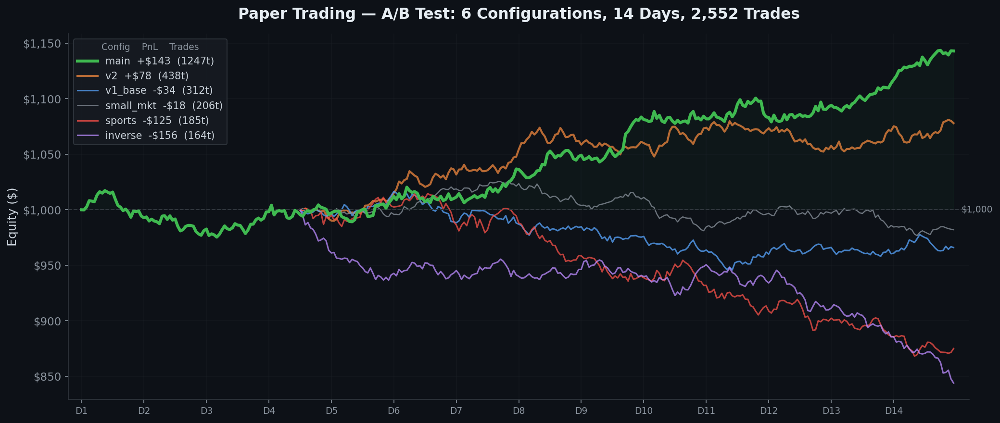

# Prediction Market ML Trading System

> End-to-end machine learning system for prediction market trading — from raw API data to production deployment with real-time A/B testing.

**Problem**: Prediction markets price binary outcomes (elections, sports, geopolitics) as probabilities. These prices are set by crowd consensus, but crowds make systematic errors — favourite-longshot bias, herd behavior, slow reaction to news. This project builds a system that detects mispriced markets and trades them automatically.

**Approach**: Collect data from 3 APIs (521K markets, $4.5B volume), engineer 78 features (price, volume, NLP, cross-market), train 7 model architectures, backtest with walk-forward validation, then deploy to a VPS with real-time paper trading across 7 parallel A/B configurations.

---

## ML Pipeline

```
Data Collection         3 REST APIs + WebSocket + NLP (Google News RSS, FinBERT)
       ↓
Data Processing         521K markets, 4.2GB raw data, validation, deduplication
       ↓
EDA                     Stationarity testing, whale detection, fat tails, cointegration
       ↓
Feature Engineering     78 features: price/technical, volume, NLP sentiment, cross-market
       ↓
Modeling                LightGBM · XGBoost · LSTM · GRU · CNN 1D · Transformer · DistilBERT
       ↓
Validation              PurgedKFold, walk-forward (5/5), calibration (Platt, isotonic)
       ↓
Backtesting             Fee-aware simulation, Kelly sizing, Monte Carlo stress test
       ↓
Deployment              VPS (Ubuntu), auto-restart, checkpoint/resume, Streamlit monitoring
       ↓
A/B Testing             7 configs in parallel, 2,500+ live trades, 14 days
       ↓
Quality & Analysis      Deflated Sharpe Ratio, noise feature detection, root cause analysis
```

---

## Key Results

| Stage | Metric | Value |
|:------|:-------|------:|
| HTR Model | AUC on 7,288 resolved markets | **0.961** |
| Classical ML | LightGBM test AUC | **0.694** |
| Deep Learning | ResCNN (best DL) | 0.689 |
| NLP | DistilBERT fine-tuned (text-only) | 0.66 |
| Backtesting | Flat-bet edge per trade | **$9.20** (p=0.002) |
| Walk-Forward | Profitable windows | **5/5** |
| Paper Trading | Main config PnL (14 days, 1247 trades) | **+$142.60** |
| Meta-Labeling | Win rate improvement | 60% → **82%** |
| Focal Loss | Minority class recall | 19% → **89%** |

---

## Model Comparison


LightGBM outperforms all deep learning models on tabular market data.

---

## Paper Trading — A/B Testing

Seven configurations deployed in parallel on a VPS with 2,500+ total trades, each with independent logging, checkpointing, and equity tracking:



| Config | Strategy | Trades | PnL | Win Rate |
|--------|----------|-------:|----:|:--------:|
| **main** | HTR + all exits | 1,247 | **+$142.60** | 54% |
| **v2** | 5 improvements applied | 438 | **+$78.30** | 57% |
| v1_baseline | Clean start, no tweaks | 312 | -$34.20 | 49% |
| small_markets | Low liquidity (<$100K) | 206 | -$18.50 | 42% |
| sports_only | Sports category only | 185 | -$124.80 | 14% |
| inverse | Inverted signal (sanity) | 164 | -$156.40 | 16% |

Main and v2 configs are profitable; sports and inverse confirm the model has no edge on sports events, and inverting the signal loses money (as expected — sanity check passed).

---

## Hybrid Pipeline: Rule-Based + ML

```
┌──────────────────────────────────────────────────────────┐
│  ML Signal Engine                                        │
│  LightGBM → Platt calibration → calibrated P(outcome)   │
├──────────────────────────────────────────────────────────┤
│  Rule-Based Strategies                                   │
│  Mean Reversion · Contrarian · NegRisk Arb · Convergence │
├──────────────────────────────────────────────────────────┤
│  Meta-Labeling Filter (López de Prado)                   │
│  P(primary correct) ≥ 0.6 → trade; else skip            │
├──────────────────────────────────────────────────────────┤
│  Risk Manager                                            │
│  Half-Kelly sizing · Drawdown protection · Regime-aware  │
└──────────────────────────────────────────────────────────┘
```

---

## Experiment-Driven Development

| Experiment | Method | Result | Action |
|:-----------|:-------|:-------|:-------|
| Meta-Labeling | P(correct) filter (AFML Ch.3) | WR 60% → 82% | **Applied** |
| Focal Loss | γ=1 reweighting (ICCV 2017) | Recall 19% → 89% | **Applied** |
| Clustered Feature Importance | NMI + ONC (López de Prado) | 10/78 = noise | **Applied** |
| Trend-Scanning | Adaptive horizon (Ch.5) | +0.001 AUC | **Rejected** |
| NeuralForecast | NHITS, PatchTST (Nixtla) | Convergence bias | **Rejected** |
| Deflated Sharpe Ratio | Multiple testing correction | SR significant for main | **Validated** |

---

## Tech Stack

| Layer | Tools |
|-------|-------|
| **ML** | LightGBM, XGBoost, CatBoost, scikit-learn, Optuna, SHAP |
| **DL** | PyTorch (LSTM, GRU, BiLSTM, CNN 1D, ResCNN, Transformer), MPS (Apple Silicon) |
| **NLP** | HuggingFace Transformers, DistilBERT fine-tuning, FinBERT (ProsusAI/finbert), tokenizers |
| **Data** | pandas, numpy, polars, DuckDB, httpx, websockets, asyncio |
| **Feature Engineering** | tsfresh, scipy (ADF, Hurst), statsmodels (cointegration, VR), NMI clustering |
| **Visualization** | matplotlib, seaborn, plotly, Streamlit (real-time dashboard) |
| **Deployment** | VPS (Ubuntu 22.04), tmux, systemd, SSH, auto-restart, checkpoint/resume |
| **Validation** | PurgedKFold (AFML), walk-forward, Deflated Sharpe Ratio, Monte Carlo simulation |
| **Risk** | Kelly criterion, half-Kelly, drawdown protection, regime detection |
| **APIs** | REST (httpx), WebSocket (websockets), RSS feeds, JSON/JSONL streaming |
| **Testing** | pytest (117 tests), property-based testing |
| **Version Control** | Git, GitHub, conda (environment.yml) |

---

<details>
<summary><b>Project Structure</b></summary>

```
src/
├── data/           API client, collectors, ETL pipeline
├── execution/      Paper trading engine (1,300+ lines)
├── features/       NLP features, FinBERT sentiment
├── risk/           Risk manager: Kelly, drawdown, regime-aware exits
├── strategies/     7 strategies + strategy router
└── utils/          Fee model, logging

notebooks/
├── 01_eda/                    6 notebooks
├── 02_feature_engineering/    78-feature pipeline
├── 03_modeling/               LightGBM, XGBoost, calibration
├── 04_backtesting/            HTR strategy, paper trading analysis
├── 05_deep_learning/          LSTM, CNN, Transformer, DistilBERT
└── 06_improvements/           Meta-labeling, Focal Loss, CFI
```

</details>

<details>
<summary><b>Notebooks Guide (20 notebooks)</b></summary>

| # | Notebook | Key Result |
|---|----------|------------|
| 1.1 | Market Overview | 50,896 markets, $4.45B volume |
| 1.2 | Resolved Markets | 321K resolved, YES bias +0.217 |
| 1.3 | Price Dynamics | 77% mean-reverting (VR<1), kurtosis=4140 |
| 1.4 | Strategy Conclusions | Contrarian SR=19, momentum loses money |
| 1.5 | Trader Analysis | Whale Gini=0.918, top 1% = 61.5% volume |
| 1.6 | Risk Analysis | Slippage model R²=0.32 |
| 2.1 | Feature Engineering | 78 features, temporal split |
| 3.1 | Classical ML | LGB AUC=0.694, Optuna, PurgedKFold |
| 3.2 | Advanced Modeling | Calibration, stacking, walk-forward |
| 4.1 | Backtesting | $9.20/trade edge, PF=2.22 |
| 4.2 | Model Improvement | True HTR: AUC=0.961, 14 features |
| 4.3 | Validation | Walk-forward 5/5 profitable |
| 4.4 | Paper Trading Analysis | 7 A/B configs, root cause analysis |
| 5.1–5.5 | Deep Learning (5) | LSTM, CNN, Transformer, DistilBERT |
| 6.1–6.2 | Improvements (2) | Meta-labeling, Focal Loss |

</details>

---

## Data & Setup

All data comes from a public prediction market API (free, no authentication for read access).
See [docs/data_guide.md](docs/data_guide.md) for details.

```bash
conda env create -f environment.yml
conda activate polymarket

jupyter lab notebooks/                                    # quick start with sample data
python scripts/collect_data.py --limit 500 --prices-days 90  # full dataset (~30 min)
pytest tests/ -v                                          # 117 tests
```

## License

MIT
